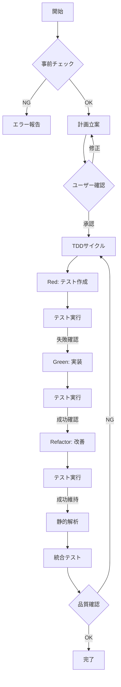

# /dev コマンド - 自律的TDD開発システム v2.0

## 🎯 コマンド概要

`/dev [機能名] [オプション]` - 完全自律的にTDD開発を実行し、品質を保証しながら機能実装を行う

## 📋 コマンドオプション

```bash
/dev [機能名]              # 標準TDD開発
/dev [機能名] --quick      # 簡易実装（テスト最小限）
/dev [機能名] --full       # 完全実装（E2E含む全テスト）
/dev [機能名] --fix        # 既存機能の修正・改善
/dev [機能名] --refactor   # リファクタリング専用
```

## 🔄 実行フローチャート



## 🚀 実行詳細

### Phase 0: 事前チェック
```typescript
// 実行前の環境確認
const preCheck = async () => {
  const checks = {
    nodeVersion: await checkNodeVersion(),     // Node.js 18+
    yarnInstalled: await checkYarn(),         // Yarn確認
    dependencies: await checkDependencies(),   // 依存関係
    database: await checkDatabase(),          // DB接続
    typescript: await checkTypeScript(),      // TS設定
  };

  if (!checks.allPassed) {
    throw new Error('環境チェック失敗');
  }
};
```

### Phase 1: 計画立案
```yaml
開発計画書テンプレート:
  機能名: ${featureName}
  概要: ${description}

  実装内容:
    - コンポーネント: [リスト]
    - API: [エンドポイント]
    - DB: [テーブル/カラム]

  テスト計画:
    単体: ${unitTestCount}件
    統合: ${integrationTestCount}件
    E2E: ${e2eTestCount}件

  予想作業:
    工数: ${estimatedHours}時間
    リスク: [潜在的問題]

  依存関係:
    前提機能: [必須機能]
    影響範囲: [影響を受ける機能]
```

### Phase 2: TDDサイクル

#### 🔴 Red Phase - テスト作成
```typescript
// テストファイル自動生成例
describe('RecipeForm', () => {
  // 1. 正常系テスト
  it('レシピを正常に作成できる', async () => {
    const recipe = await createRecipe(validData);
    expect(recipe).toBeDefined();
    expect(recipe.title).toBe(validData.title);
  });

  // 2. 異常系テスト
  it('不正なデータでエラーを返す', async () => {
    await expect(createRecipe(invalidData))
      .rejects.toThrow('Validation error');
  });

  // 3. エッジケーステスト
  it('最大文字数で正常動作する', async () => {
    const maxLengthData = generateMaxLengthData();
    const recipe = await createRecipe(maxLengthData);
    expect(recipe).toBeDefined();
  });
});
```

#### 🟢 Green Phase - 最小実装
```typescript
// 最小実装の原則
export async function createRecipe(data: RecipeInput) {
  // 1. バリデーション（最小限）
  if (!data.title) {
    throw new Error('Validation error');
  }

  // 2. DB保存（シンプル）
  const recipe = await prisma.recipe.create({
    data: {
      title: data.title,
      // 必須フィールドのみ
    },
  });

  // 3. レスポンス
  return recipe;
}
```

#### 🔄 Refactor Phase - 改善
```typescript
// リファクタリング後
export async function createRecipe(data: RecipeInput) {
  // 1. 詳細バリデーション
  const validated = recipeSchema.parse(data);

  // 2. トランザクション処理
  const recipe = await prisma.$transaction(async (tx) => {
    // レシピ作成
    const newRecipe = await tx.recipe.create({
      data: normalizeRecipeData(validated),
    });

    // 関連データ作成
    if (validated.ingredients) {
      await createIngredients(tx, newRecipe.id, validated.ingredients);
    }

    return newRecipe;
  });

  // 3. キャッシュ更新
  await updateCache(recipe);

  // 4. 整形したレスポンス
  return formatRecipeResponse(recipe);
}
```

### Phase 3: 品質保証

#### 静的解析チェックリスト
```bash
✅ TypeScript
  □ 型エラー: 0件
  □ strict mode: 有効
  □ any使用: 0件

✅ ESLint
  □ エラー: 0件
  □ 警告: 最小限
  □ 自動修正: 実行済

✅ セキュリティ
  □ 依存関係脆弱性: 0件
  □ OWASP Top 10: 対策済
  □ 認証・認可: 実装済

✅ パフォーマンス
  □ バンドルサイズ: 閾値以下
  □ 実行時間: 基準内
  □ メモリ使用: 正常範囲
```

## 📊 実行レポート形式

### 成功時レポート
```markdown
## 🎉 開発完了レポート

### 📌 実装機能
- **機能名**: レシピ作成機能
- **実行時間**: 45分
- **実装ファイル**: 12件

### ✅ テスト結果
- 単体テスト: 24/24 成功
- 統合テスト: 8/8 成功
- E2Eテスト: 3/3 成功
- カバレッジ: 92%

### 📈 品質メトリクス
- TypeScriptエラー: 0
- ESLint警告: 2（自動修正済）
- 複雑度: 8（基準内）
- パフォーマンススコア: 95

### 📝 作成ファイル
1. `src/components/recipe/RecipeForm.tsx`
2. `src/app/api/recipes/route.ts`
3. `__tests__/recipe/RecipeForm.test.tsx`
...

### 🔄 次のステップ
1. UI/UXレビュー実施
2. アクセシビリティテスト
3. 本番環境デプロイ準備
```

### エラー時レポート
```markdown
## ⚠️ 開発中断レポート

### 🔍 検出された問題
**エラー種別**: TypeScript型エラー
**深刻度**: High
**ファイル**: `src/lib/api/recipes.ts`

### 📍 エラー詳細
```typescript
Type 'string | undefined' is not assignable to type 'string'.
  Type 'undefined' is not assignable to type 'string'.
```

### 💡 推奨解決策
1. Null合体演算子を使用
```typescript
const title = data.title ?? '';
```

2. 型ガードを追加
```typescript
if (!data.title) {
  throw new Error('Title is required');
}
```

### 🔧 自動修正試行結果
- 試行回数: 3回
- 修正成功: 部分的
- 手動介入必要: Yes

### 📋 未完了タスク
- [ ] 型エラー修正
- [ ] テスト再実行
- [ ] 静的解析通過
```

## 🎮 インタラクティブモード

### ユーザー対話フロー
```typescript
// 計画確認時
console.log('📋 開発計画を作成しました');
console.log('確認してください:');
console.log('- 承認: Enter or "yes"');
console.log('- 修正: /reject [修正内容]');
console.log('- 中止: /cancel');

// エラー発生時
console.log('⚠️ 問題が検出されました');
console.log('対応を選択してください:');
console.log('1. 自動修正を試行');
console.log('2. 手動修正モードへ');
console.log('3. スキップして続行');
console.log('4. 開発を中止');
```

## 🔧 高度な設定

### カスタム設定ファイル (.devrc.json)
```json
{
  "tdd": {
    "testFirst": true,
    "coverage": {
      "threshold": 80,
      "enforceThreshold": true
    },
    "testRunner": "jest"
  },
  "analysis": {
    "typescript": {
      "strict": true,
      "noAny": true
    },
    "eslint": {
      "autoFix": true,
      "maxWarnings": 0
    }
  },
  "automation": {
    "autoCommit": false,
    "autoPush": false,
    "generateDocs": true
  },
  "performance": {
    "bundleSizeLimit": "500kb",
    "lighthouse": {
      "performance": 90,
      "accessibility": 100
    }
  }
}
```

## 🚦 ステータスコード

| コード | 状態 | 説明 |
|--------|------|------|
| 0 | SUCCESS | 正常完了 |
| 1 | PARTIAL | 部分完了（警告あり） |
| 2 | FAILED | 失敗（修正必要） |
| 3 | BLOCKED | ブロック（依存関係） |
| 4 | CANCELLED | ユーザーによる中止 |

## 📚 ベストプラクティス

### 1. 小さく始める
```bash
# ❌ 避ける
/dev 全機能実装

# ✅ 推奨
/dev ユーザー登録
/dev ログイン機能
/dev プロフィール編集
```

### 2. テストファースト
```bash
# 常にテストから開始
/dev [機能] --test-first
```

### 3. 継続的な品質確認
```bash
# 開発中も定期的に実行
/analyze
/test all
```

## 🔗 関連コマンド

- `/test` - テスト実行
- `/analyze` - 静的解析
- `/docs` - ドキュメント生成
- `/status` - 進捗確認
- `/rollback` - 変更取り消し

---

**バージョン**: 2.0.0
**最終更新**: 2025年8月21日